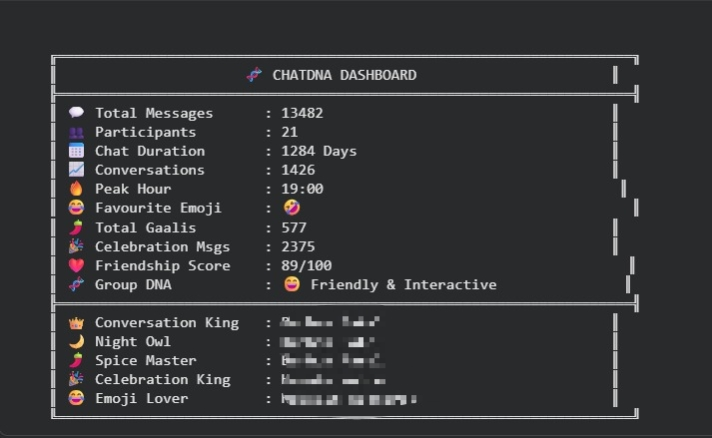
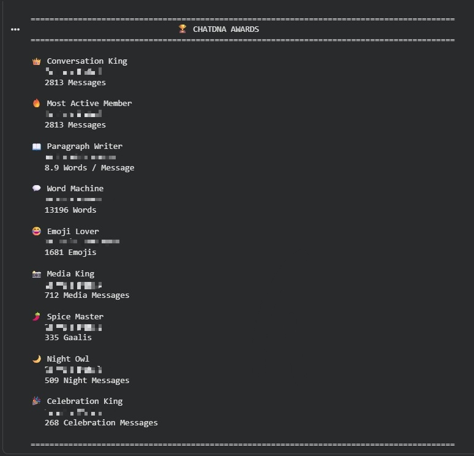
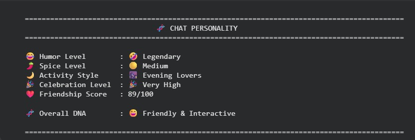
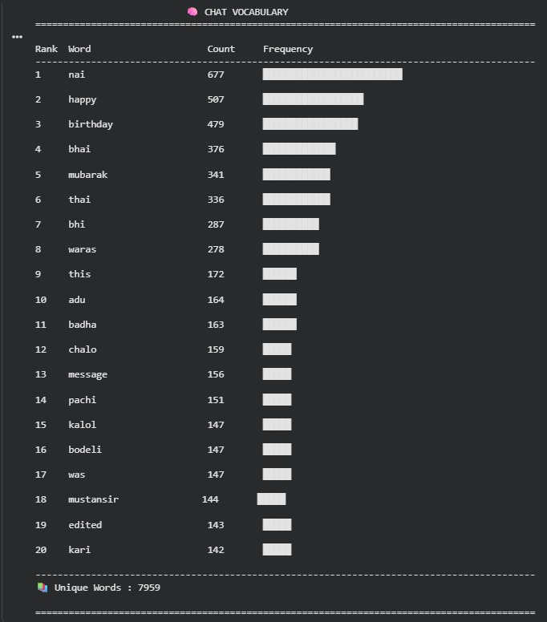
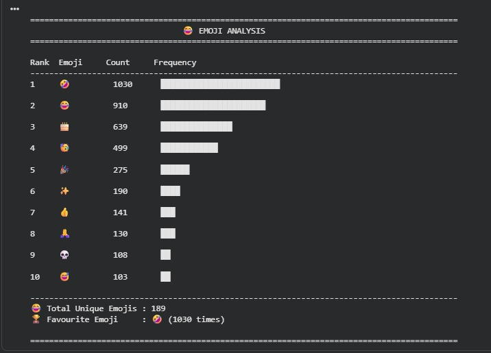

# 🧬 ChatDNA – WhatsApp Chat Analyzer

ChatDNA is a WhatsApp Chat Analyzer built using **Python fundamentals**. It analyzes exported WhatsApp chat files and generates meaningful insights about conversations, participant activity, communication patterns, emojis, vocabulary, and group behavior.

---

## ✨ Features

* 📊 Chat Overview
* 👥 Participant Analysis
* 📅 Timeline Analysis
* ⏰ Hourly Activity Analysis
* 🧠 Chat Vocabulary Analysis
* 😂 Emoji Analysis
* 🌶️ Slang & Communication Analysis
* 🏆 ChatDNA Awards
* 💬 Conversation Insights
* 🧬 Chat Personality
* 📋 Final Dashboard

---

## 🛠️ Technologies Used

* Python
* NumPy
* Google Colab

---

## 📸 Project Screenshots

### 🧬 ChatDNA Dashboard

---

### 🏆 ChatDNA Awards

---

### 🧬 Chat Personality

---

### 🧠 Chat Vocabulary

---

### 😂 Emoji Analysis

---

## 🚀 How to Run

1. Open the notebook in Google Colab.
2. Upload an exported WhatsApp chat (`.txt`) file.
3. Run all cells.
4. View the generated analytics and dashboard.

---

## 📌 Future Improvements

* Interactive charts
* Word Cloud
* Sentiment Analysis
* Member Relationship Network
* Chat Similarity Analysis
* Export Reports as PDF

---

## 📄 License

This project is created for learning and portfolio purposes.
